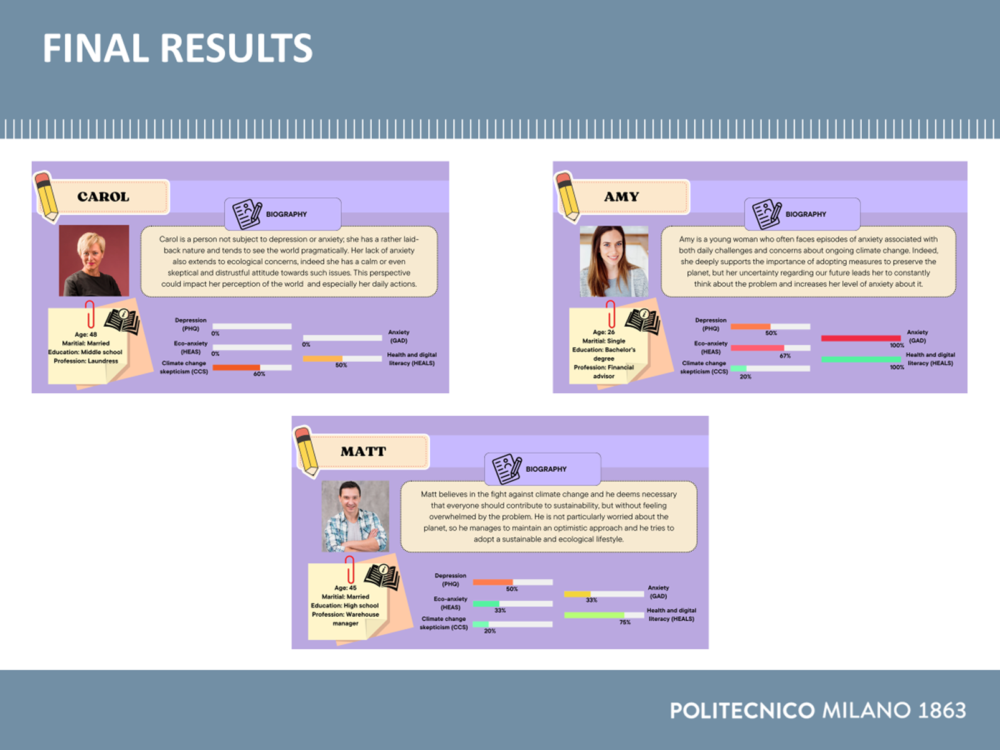

# 🛒 SpesaAmica

**Data analysis and game development of the SpesaAmica game**

---

## 📖 Introduction
SpesaAmica is a project that combines **data analysis** and **game development**, with the goal of creating a customizable game based on the personas identified from the data.

---

## 📂 Project Structure
- The Python code used for data cleaning, analysis, clustering, and statistical evaluation is stored in the **`Python Final`** folder.  
- The Unity project used for game development is in the **`Unity`** folder.  
- A PowerPoint presentation summarizing the entire work can be found in **`Group07_Presentation.pptx`**.  

---

## 🖼️ Summary Images

## 🧑‍💻 Contributions
- [Lucia Giuffrida](https://github.com/LuciaGiuffrida)
- [Alessia Lenoci](https://github.com/lenoxxxx)
- [Anna Gianfrancesci](https://github.com/AnnaGianfranceschi)
- Ilaria Grimonte
---

